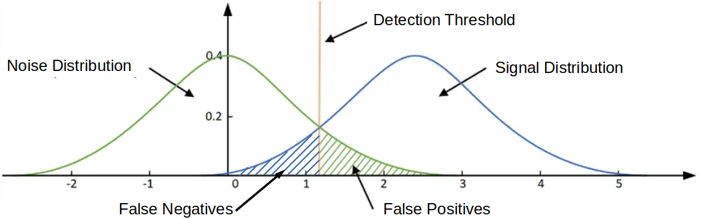
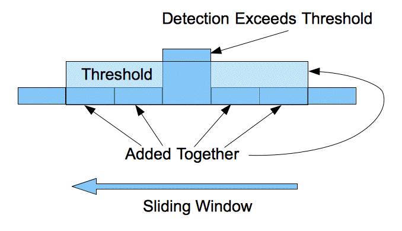
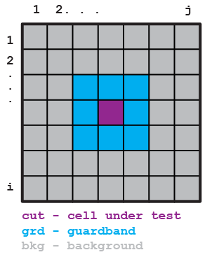
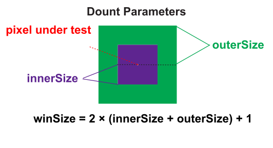

# Two-Dimensional (2D) Intel Integrated Performance Primitives (IPP) Constant False Alarm Rate (CFAR) Detector

Here we demonstrate a two-dimensional (2D), background Gaussian statistics, Constant False Alarm Rate (CFAR) detector using's Intel's Integrated Performance Primitives (IPP).

Two-dimensional CFAR detectors are useful when detecting relatively small and bright clusters of pixels in a image. Two possible examples include separating man-made objects (i.e. partially metallic objects with right-angles) in Synthetic Aperture Radar (SAR) images from natural background or finding bright astronomical objects (i.e. stars) in an image with a non-uniform background where simple thresholding is insufficient.

## Background

### Constant False Alarm Detectors

The ability to differentiate target signal from background noise is an important problem, especially when the target and background distributions overlap. When there is overlap, perfect separation between target and background is impossible. Instead, a threshold value must be chosen such that values above are considered targets and values below are background. However, due to the overlap in distributions, there will be false positives (i.e. false alarms) and false negatives
(i.e. missed targets).



**Figure adapted from An, G., Huang, Z. & Li, Y. Constant false alarm rate detection of pipeline leakage based on acoustic sensors. Sci Rep 13, 14149 (2023).**

Furthermore, when the background and target distributions are not fixed, a
threshold needs to be recalculated throughout the image. The Constant False Alarm Rate (CFAR) detector updates the threshold value depending on a
current estimate of the background. Assuming the background has a Gaussian distribution, the threshold is selected such that the probably of a false alarm is constant.



**Image from Wiki Commons posted by [Nanoatzin](https://commons.wikimedia.org/wiki/File:Constant_false_alarm_rate.png).**

## Guard Band

Sometimes captured images will contain blooming/bleeding pixels. This phenomenon occurs when the intensity of the source overwhelms the detector and the electrons from on pixel well spill over into adjacent wells. To overcome this artifact, a guard band is used around the cell-under-test (also called the pixel-under-test).



The 2D CFAR detector geometry looks like a donut. The image background is the outer ring (shown in gray above and shown in green below). The Guard band (shown in blue above and shown in purple below) excludes pixels surrounding the cell/pixel-under-test.



The background (outerSize) and the guard band (inner size) need to be adjust for the particular image collection.

The total size of the 2D area (window size) is given by 2 x (innerSize + outerSize) + 1.

## Setup

[IPP](https://www.intel.com/content/www/us/en/developer/tools/oneapi/ipp.html) needs to be installed.
A standalone installation of IPP is used.
A getting started guide is [here](https://www.intel.com/content/www/us/en/develop/documentation/get-started-with-ipp-for-oneapi-linux/top.html) with some example code which is copied to `ipp_getting_started_example.cpp` with the `@` characters removed (g++ did not compile with unicode).

To compile:

```bash
source /opt/intel/oneapi/ipp/latest/env/vars.sh
g++ ipp_getting_started_example.cpp -o ipp_getting_started_example -I $IPPROOT/include -L $IPPROOT/lib/linux -lippcore
```

Finally, execute `./ipp_getting_started_example`.
You should see a print out of a table with features and their support.

[OpenCV](https://opencv.org/) is used to read in images.
It's built from source.
A function to test loading and displaying an image can be built and ran with

```bash
 g++ open_image.cpp -o open_image `pkg-config --cflags --libs opencv4` && ./open_image 
```

The above code uses [this star image](https://pixabay.com/photos/astronomy-bright-constellation-dark-1867616/) the open source image from pixabay.

## Main Program

add IPP headers and libraies to path

```bash
source /opt/intel/oneapi/ipp/latest/env/vars.sh 
```

Build and run with

```bash
g++ main.cpp -o main -I $IPPROOT/include -L $IPPROOT/lib/intel64 -lippi -lipps -lippcore -lippcv `pkg-config --cflags --libs opencv4` && ./main 
```

Build and check for memory leaks with:

```bash
g++ main.cpp -g -oo -Wextra -pedantic -Wshadow -I $IPPROOT/include -L $IPPROOT/lib/intel64 -lippi -lipps -lippcore -lippcv `pkg-config --cflags --libs opencv4` -o main && valgrind --leak-check=full --show-leak-kinds=all -s ./main 
```

## References and Further Reading

- [Wikipedia article on Constant False Alarm Rate Detectors](https://en.wikipedia.org/wiki/Constant_false_alarm_rate)
- [An, G., Huang, Z. & Li, Y. Constant false alarm rate detection of pipeline leakage based on acoustic sensors. Sci Rep 13, 14149 (2023).](https://doi.org/10.1038/s41598-023-41177-3)

## Testing

A version of the code, employing the same math, was written in python and opencv.
This allows a cross check of the IPP and C++ code.
A script called `create_test_image.py` saves a *test_image.png*.
This test image can be used with these parameters `python main.py -I test_image.png -G 3 -B 7` to verify the calculations are correct.
